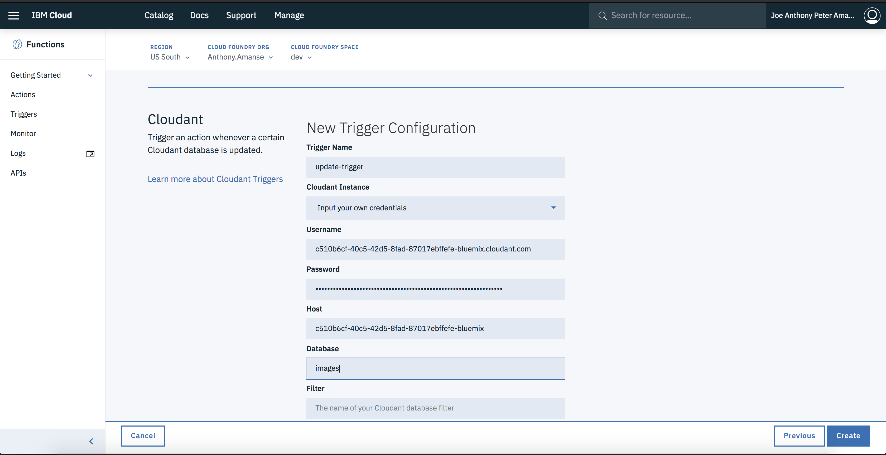
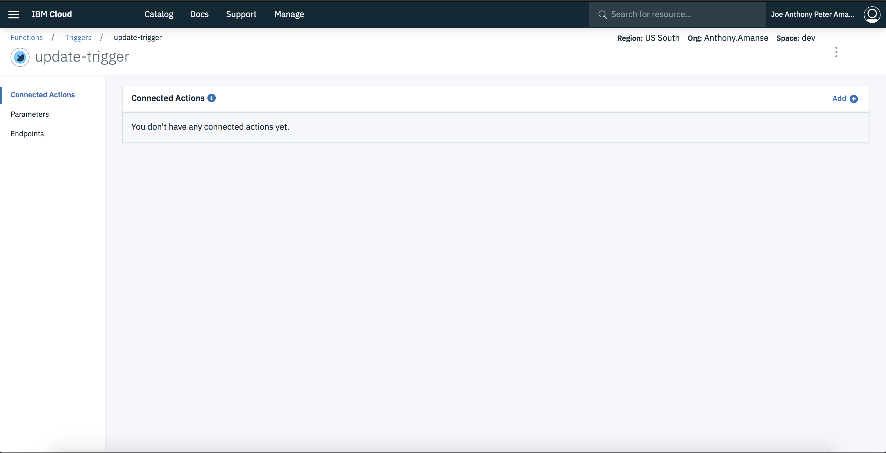
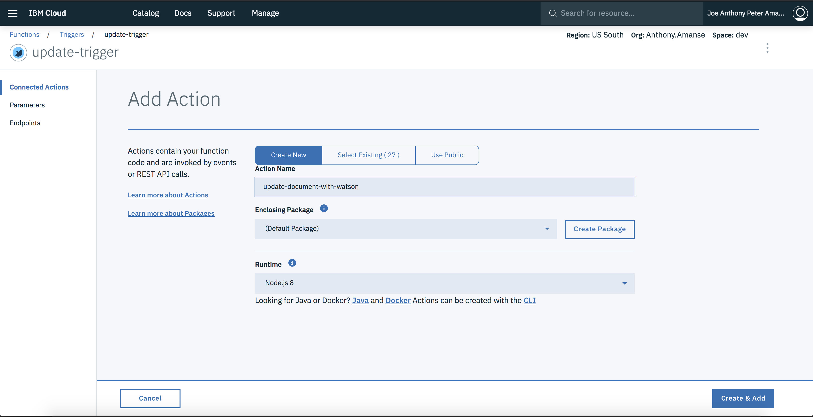
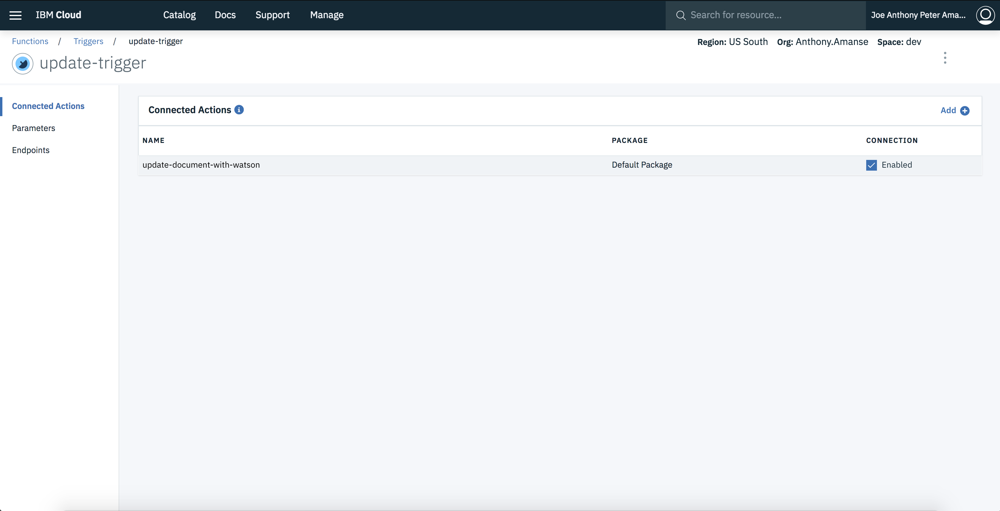
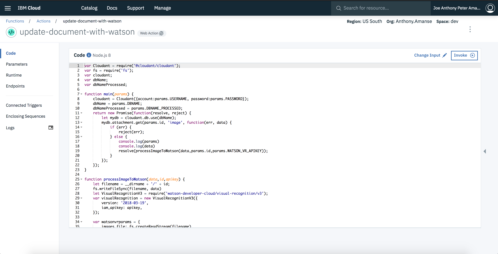
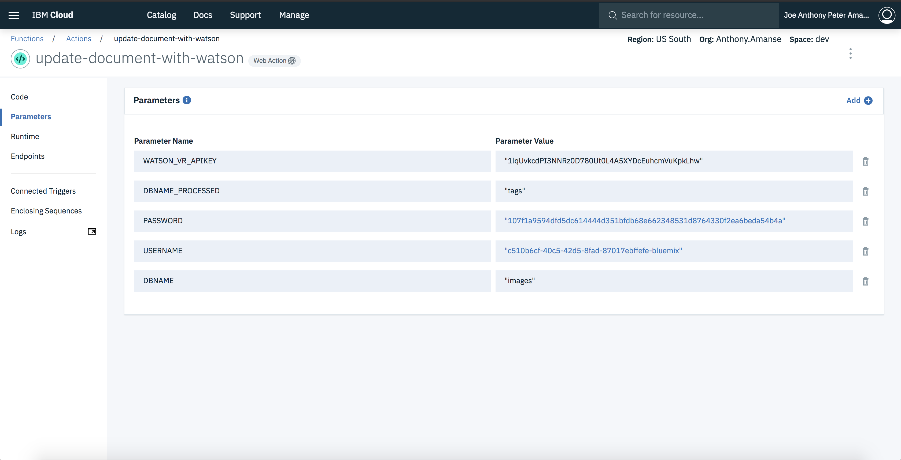

# Deploy through the IBM Cloud Functions console user interface

* Click on `Create Trigger` then choose `Cloudant`. At the **Cloudant Instance** section, choose to "Input your own credentials". Enter your Cloudant's **Username**, **Password**, **Host**. Enter `images` as your **Database** if you have created that name of the database at the previous step. Name the Trigger "update-trigger".

* Then click on `Add +` on the **Connected Actions section** then choose `Create Action` with a `Node.js 8` as the **Runtime**. Name the action "update-document-with-watson".

* Then click on the action and copy and paste the code in [`actions/updateDocumentWithWatson.js`](actions/updateDocumentWithWatson.js) to the editor in the browser.

* Then go to the `Parameters` section and add these parameters with the values of your own.

You may now proceed to [Step 4 in the main README](README.md#4-launch-application)