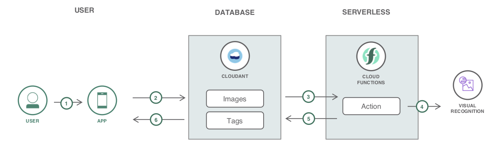
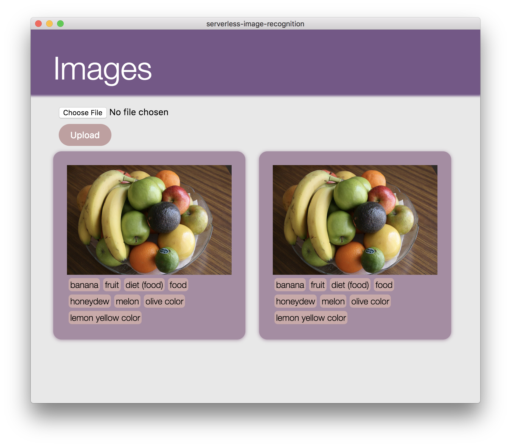

[](https://travis-ci.com/IBM/ibm-cloud-functions-refarch-serverless-image-recognition)

# Serverless Image Recognition with Cloud Functions

The application demonstrates an IBM Cloud Functions (based on Apache OpenWhisk) that gets an image from the Cloudant database and classifies it through Watson Visual Recognition. The use case demonstrates how actions work with data services and execute logic in response to Cloudant events.

One function, or action, is triggered by changes (in this use case, an upload of a document) in a Cloudant database. These documents are piped to another action that submits the image to Watson Visual recognition and upload a new document in Cloudant with the classifiers produced by Watson.

When the reader has completed this Code Pattern, they will understand how to:

* Create and Deploy Cloud Functions
* Trigger Cloud Functions with Cloudant changes
* Use Watson Image Recognition with Cloud Functions



## Flow

1. User chooses a picture from the gallery.
2. The image is stored in the Cloudant database.
3. Cloud Function is triggered when there's a new image in the database.
4. Cloud Function gets the image and uses Watson Visual Recognition to process the image.
5. Cloud Function stores the results (classes with scores) from Visual Recognition in the database.
6. The user can see the new tags or classes in the image they uploaded.

## Included components

* [IBM Cloud Functions](https://console.ng.bluemix.net/openwhisk) (powered by Apache OpenWhisk): Execute code on demand in a highly scalable, serverless environment.
* [Cloudant](https://console.ng.bluemix.net/catalog/services/cloudant-nosql-db): A fully managed data layer designed for modern web and mobile applications that leverages a flexible JSON schema.
* [Watson Visual Recognition](https://www.ibm.com/watson/developercloud/visual-recognition.html): Visual Recognition understands the contents of images - visual concepts tag the image, find human faces, approximate age and gender, and find similar images in a collection.

## Featured technologies

* [Serverless](https://www.ibm.com/cloud-computing/bluemix/openwhisk): An event-action platform that allows you to execute code in response to an event.

# Prerequisites

* [IBM Cloud Functions CLI](https://console.bluemix.net/openwhisk/learn/cli) to create cloud functions from the terminal. Make sure you do the test action `ibmcloud wsk action invoke /whisk.system/utils/echo -p message hello --result` so that your `~/.wskprops` is pointing to the right account.

* [Whisk Deploy _(wskdeploy)_](https://github.com/apache/incubator-openwhisk-wskdeploy) is a utility to help you describe and deploy any part of the OpenWhisk programming model using a Manifest file written in YAML. You'll use it to deploy all the Cloud Function resources using a single command. You can download it from the [releases page](https://github.com/apache/incubator-openwhisk-wskdeploy/releases) and select the appropriate file for your system.

* Install [Node.js](https://nodejs.org/) if you want to use Electron.

# Steps

### 1. Clone the repo

Clone the `serverless-image-recognition` locally. In a terminal, run:

```
$ git clone https://github.com/IBM/serverless-image-recognition
```

### 2. Create IBM Cloud Services

Create a [**Cloudant**](https://console.bluemix.net/catalog/services/cloudant) instance and choose `Use both legacy credentials and IAM` for the _Available authentication method_ option.
* Create credentials for this instance and copy the username and password in the `local.env` file in the value of `CLOUDANT_USERNAME` and `CLOUDANT_PASSWORD`.
* Launch the Cloudant web console and create a database named `images` and `tags`. Create Cloudant credentials using the IBM Cloud dashboard and place them in the `local.env` file.
> Modify `local.env` as needed if you have plan to have different database names.

Create a [Watson Visual Recognition](https://console.bluemix.net/catalog/services/visual-recognition) instance.
* Copy the API Key in the Credentials section and paste it in the `local.env` file in the value of `WATSON_VISUAL_APIKEY`

### 3. Deploy Cloud Functions
> Choose one of the deployment methods

## Deploy through the IBM Cloud Functions console user interface

Choose ["Start Creating"](https://console.bluemix.net/openwhisk/create) in the IBM Cloud Functions Dashboard. [Then proceed to this deployment instructions using the UI](README-Deploy-UI.md).

You can also deploy them directly from the CLI by following the steps in the next section.

## Deploy using the `wskdeploy` command line tool

This approach deploy the Cloud Functions with one command driven by the runtime-specific manifest file available in this repository.

Make sure you have the right environment variables in the `local.env` file. Export them in your terminal then deploy the Cloud Functions using `wskdeploy`. This uses the `manifest.yaml` file in this root directory.

```
$ source local.env
$ wskdeploy
```

> You may want to undeploy them later with `wskdeploy undeploy`

### 4. Launch Application

Configure `web/scripts/upload.js`. Modify the lines for your Cloudant credentials.

```js
let usernameCloudant = "YOUR_CLOUDANT_USERNAME"
let passwordCloudant = "YOUR_CLOUDANT_PASSWORD"
```

Run the Electron app or open the html file.

* Electron:
```
$ npm install
$ npm start
```

* _(or) Double-click `web/index.html`_

# Sample output



# Alternative Deployment Methods

### Deploy manually with the `ibmcloud wsk` command line tool

This approach shows you how to deploy individual the packages, actions, triggers, and rules with CLI commands. It helps you understand and control the underlying deployment artifacts.

* Export credentials
```
$ source local.env
```

* Create Cloudant Binding

```
$ ibmcloud wsk package bind /whisk.system/cloudant serverless-pattern-cloudant-package \
-p username $CLOUDANT_USERNAME \
-p password $CLOUDANT_PASSWORD \
-p host ${CLOUDANT_USERNAME}.cloudant.com
```

* Create the Cloudant Trigger

The trigger will listen to changes in the `images` database.

```
$ ibmcloud wsk trigger create update-trigger --feed serverless-pattern-cloudant-package/changes \
--param dbname images
```

* Create the Action

The action executes your code. The code is already configured to use the Watson SDK.

```
$ ibmcloud wsk action create update-document-with-watson actions/updateDocumentWithWatson.js \
--kind nodejs:8 \
--param USERNAME $CLOUDANT_USERNAME \
--param PASSWORD $CLOUDANT_PASSWORD \
--param DBNAME $CLOUDANT_IMAGE_DATABASE \
--param DBNAME_PROCESSED $CLOUDANT_TAGS_DATABASE \
--param WATSON_VR_APIKEY $WATSON_VISUAL_APIKEY
```

* Create the Rule

The rule will connect invoke the action when the trigger receives an event.

```
$ ibmcloud wsk rule create update-trigger-rule update-trigger update-document-with-watson
```

* To delete them

```
$ ibmcloud wsk package delete serverless-pattern-cloudant-package
$ ibmcloud wsk trigger delete update-trigger
$ ibmcloud wsk action delete update-document-with-watson
$ ibmcloud wsk rule delete update-trigger-rule
```

# Links

* [Apache OpenWhisk](http://openwhisk.incubator.apache.org/): Open source cloud platform that executes functions in response to events at any scale.
* [Node.js Cloudant](https://github.com/cloudant/nodejs-cloudant): Official Cloudant library for Node.js.
* [Watson APIs Node.js SDK](https://github.com/watson-developer-cloud/node-sdk): Node.js client library to use the Watson APIs.

# License
This code pattern is licensed under the Apache Software License, Version 2.  Separate third party code objects invoked within this code pattern are licensed by their respective providers pursuant to their own separate licenses. Contributions are subject to the [Developer Certificate of Origin, Version 1.1 (DCO)](https://developercertificate.org/) and the [Apache Software License, Version 2](http://www.apache.org/licenses/LICENSE-2.0.txt).

[Apache Software License (ASL) FAQ](http://www.apache.org/foundation/license-faq.html#WhatDoesItMEAN)
